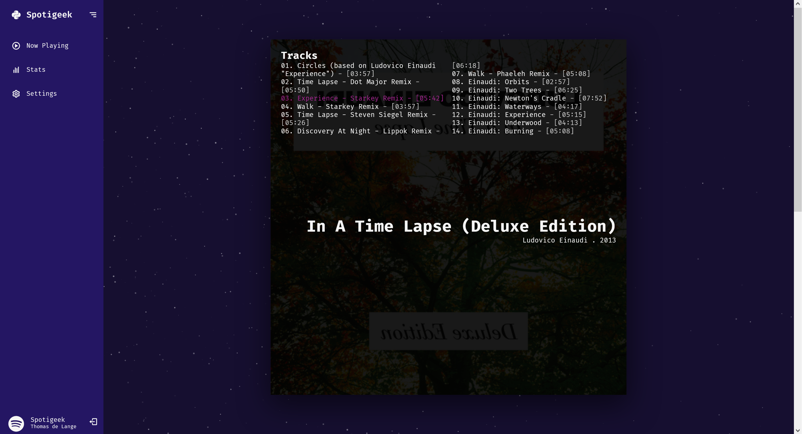

# Spotigeek
Get to know yourself better by analyzing spotify user data. Currently displays the song and corresponding album that the authorized user is playing.




## Installation and usage
Clone the repository
```
git clone https://github.com/thmsdelange/spotigeek.git
```
Install the Python dependencies
```
python -mpip install -r requirements.txt
```
Create a `.env` file (see `.env.example`) and set the secrets and spotify tokens. Then run `flask run` to start the server and navigate to `http://127.0.0.1:5000/` to view the application.

## License
This project is licensed under the GNU General Public License v3.0, so feel free to contribute!